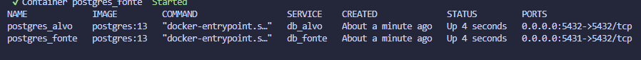

# data_eng_test

Teste prático consistindo na implementação de uma pipeline ETL simplificada entre dois bancos de dados, com uma API e um script ETL.

## Como rodar o projeto

### Requisitos

* Docker instalado na máquina
* Python versão 3.12

### Passo a passo

1. O primeiro passo é a criação de Virtual Environment Python, para isolar nosso ambiente de execução, então, usando python 3.12, execute o seguinte comando no terminal:

    ```powershell
    python -m venv .venv
    ```

    O nome do Virtual Environment é arbitrário, se python 3.12 não for o principal na sua máquina, utilize o caminho até ele.

2. Após a criação do Venv, ative-o:

    windows:
    ```powershell
    .\.venv\Scripts\activate
    ```
    linux:
    ```powershell
    source .venv/bin/activate
    ```

3. Para iniciar os bancos de dados, rode o seguinte comando no terminal:

    ```powershell
    docker-compose up -d
    ```

    Ao rodar esse comando, as bases de dados fonte e alvo devem iniciar-se. É possível verificar através do comando ```docker-compose ps```, obtendo algo como:



4. Instalar as dependências do projeto. Nesse projeto, usei poetry como gestor de dependências, então recomendo utilizá-lo também, logo caso não o tenha, use pip para instalá-lo ```pip install poetry```

    Em seguida, instale as dependências do projeto usando poetry:

    ```powershell
    poetry install
    ```

5. Popular a base de dados Fonte:
    
    Para popular a base de dados fonte, há disponível um dataset com valores históricos de velocidade do vento, temperatura ambiente e direção do vento para a cidade de Basileia (Suiça) para o período de 01/10/2024 a 22/10/2024.

    Para executar o script automática que formata esses dados e preenche a Base de dados fonte com os dados de potência, velocidade do vento e temperatura ambiente, execute o seguinte comando no terminal:

    ```powershell
    popular_fonte
    ```

6. Com todas as dependências instaladas e a base de dados fonte populada, inicie a API de comunicação à Base de dados Fonte:

    ```powershell
    uvicorn etl.api.app:app
    ```

7. Para executar o script ETL, execute o seguinte comando na linha de comando:

    ```powershell
    etl -date 2024-10-01
    ```

    Onde o valor 2024-10-01 é apenas um exemplo. No banco de dados fonte, há dados entre 01/10/2024 e 22/10/2024. Atente para especificar a data no formato YYYY-MM-DD e apenas uma data de cada vez.

    Nota: Se rodar mais de uma vez para a mesma data, o comportamento atual é sobrescrever o dado repetido com o ultimo enviado.

8. Para verificar os dados inseridos na Base de dados Alvo, há um script python chamado "leitura_exemplo.py" na pasta "etl", o qual le os dados para o dia 2024-10-01. Pode-se alterar a data e horário para verifição dos dados nesse script e executá-lo, então, pode-se ver o dataframe equivalente a esses períodos da base de dados.

### Considerações finais e limitações

    Nesta seção, há um breve resumo de algumas melhorias possíveis à rotina atual, para aumentar a robustez do script ETL:

        1. Um dos primeiros pontos para melhorar a robustez seria a conferência do dado de entrada, um tipo de data quality dos inputs, visto que poderia haver dados faltantes no banco de dados fonte (timestamp faltando, valor NaN em um certo timestamp ...). Além de dados faltantes, podem haver outliers, como um valor de temperatura de 70 °C num dia em que a máxima do local foi de 30 °C, ou valores fisicamente impossíveis para a variável. No caso do ETL atual, em que há uma agregação dos dados de 1-minutal para 10-minutal, poder-se-ia ter um tipo de score medindo a porcentagem dessas 10 medidas agrupadas que eram claramente dado contaminado.

        2. Um segundo ponto de melhoria seria um sistema mais robusto de gestão de exceções, como mensagens pré-definidas para possíveis errors que venha a ocorrer na execução. Um possível erro que pode ocorrer é quando o banco fonte está offline (o script atual propaga a exceção recebida pela requisição http). Em um sistema de produção com scheduling, seria ideal que identificasse que a exceção veio de API offline e tentar novamente rodar o script em alguns minutos.

        3. Um outro ponto seria a transmissão de dados continua, em que a API poderia usar o tipo de resposta "StreamingResponse" do fastapi para enviar dados continuamente, a medida que fossem medidos (nesse caso o cliente teria que suportar essa infra-estrutura também). De maneira análoga, usando o AsyncClient do httpx poderíamos receber esses dados em streaming da API. Dados em streaming, no entanto, requer uma maior atenção quanto à qualidade dos dados.

# Problema

## Sumário

O teste prático consiste na implementação de uma pipeline de ETL simplificado envolvendo dois bancos de dados (Fonte e Alvo), uma API isolando o banco de dados fonte e um script de ETL para transferir dadosde um para o outro.

Deverão ser criados dois bancos de dados, Fonte e Alvo, ambos em postgresql. O banco de dados Fonte deverá ser acessado através de uma API escrita em fastapi. O script de ETL deve acessar a API usando a biblioteca httpx e escrever os resultados no banco de dados Alvo utilizando a biblioteca sqlalchemy (e, opcionalmente, pandas).

## Banco de Dados Fonte

Criar um banco de dados postgresql. O banco deverá conter as seguintes tabelas e colunas:

  * data
    * timestamp
    * wind_speed
    * power
    * ambient_temprature

Inserir dados aleatórios nela com frequência 1-minutal e intervalo de 10 dias. Especificar na entrega do teste o período de dados contido no banco.

## Banco de Dados Alvo

Criar outro banco de dados postgresql. O banco deverá conter as seguintes tabelas e colunas:

  * signal
    * id
    * name
  * data
    * timestamp
    * signal_id
    * value

Esse banco deverá ser criado utilizando-se a biblioteca sqlalchemy. Cabe ao candidato estabelecer relações apropriadas entre as tabelas, bem como inserir dados auxiliares necessários a execução do processo de ETL.

## Conector

Criar uma API em fastapi para expor dados do banco de dados Fonte.

Deverá ser implementada uma rota que permita a consulta aos dados da tabela data, filtrados por intervalo de tempo. A rota deverá permitir a seleção de uma ou mais variáveis a serem retornadas.

A API poderá conter rotas-extras.

## ETL

Escrever um script em python para executar o processo de ETL:

  * Recebe uma data como input,
  * Consulta dados para variáveis wind_speed e power via API para o dia daquela data. O script deverá se consultar a API utilizando a biblioteca httpx.
  * Agrega o dado 10-minutal com agregações de média, mínimo, máximo e desvio padrão. A transformação de dados pode ser implementada com qualquer biblioteca, desde que ela seja executada de forma eficiente. Recomenda-se a utilização do pandas ou similar.
  * Salva o dado no banco de dados Alvo. A escrita no banco de dados deverá utilizar a biblioteca sqlalchemy para se conectar ao banco. A escrita do dado no banco pode ser feita com qualquer tecnologia, mas recomenda-se o uso do pandas em conjunto com o sqlalchemy.

## Bonus: Dagster

Orquestrar o script de ETL utilizando o dagster. Implementar:

  * Recurso para acessar banco de dados Fonte.
  * Recurso para acessar banco de dados Alvo.
  * Asset particionado diário para executar o processo de ETL.
  * Job e Schedule.
  * Essa etapa não é obrigatória.
